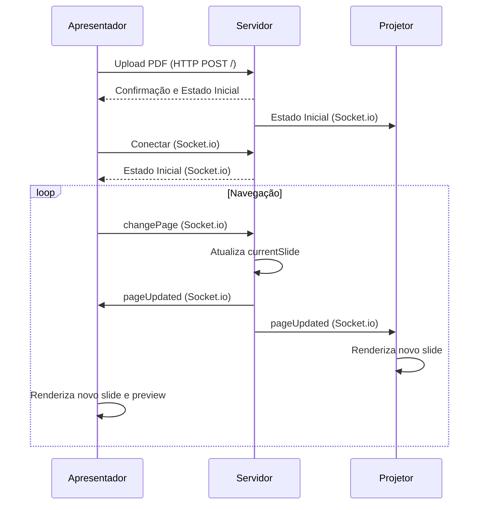

# Fluxo de Execução da Aplicação Cursor

## Visão Geral

O fluxo de execução da aplicação Cursor é centrado na comunicação em tempo real entre o servidor e os clientes (Projetor e Apresentador) para sincronizar a exibição de apresentações em PDF. Este documento detalha os principais fluxos de interação, desde o upload do PDF até a sincronização da navegação entre os slides.

## 1. Inicialização do Servidor

1.  O servidor Node.js é iniciado, carregando o Express.js e o Socket.io.
2.  As rotas HTTP (`/`, `/view`, `/admin`) são configuradas pelo Express.js.
3.  O Socket.io inicia o servidor WebSocket, aguardando conexões de clientes.
4.  O servidor loga seu IP local e porta para fácil acesso.

## 2. Upload de Arquivo PDF

1.  O apresentador acessa a rota raiz (`/`) da aplicação via navegador.
2.  Uma interface simples de upload de arquivo é exibida.
3.  O apresentador seleciona e envia um arquivo PDF.
4.  O servidor recebe o arquivo via Multer, salva-o em um diretório configurado (e.g., `/uploads`).
5.  O servidor processa o PDF para obter o número total de páginas (`totalSlides`).
6.  O estado global da apresentação é atualizado com `pdfUrl`, `fileName`, `totalSlides` e `currentSlide` (definido como 1).
7.  O servidor emite um evento Socket.io para todos os clientes conectados (se houver) informando sobre o novo PDF carregado e o estado inicial.

## 3. Conexão de Clientes (Projetor e Apresentador)

1.  **Projetor:** Um dispositivo (e.g., um navegador em um projetor) acessa a rota `/view`.
2.  **Apresentador:** O dispositivo do apresentador (desktop, tablet, celular) acessa a rota `/admin`.
3.  Ambos os clientes estabelecem uma conexão WebSocket com o servidor via Socket.io.
4.  Ao se conectar, o servidor envia o estado global atual da apresentação (incluindo `pdfUrl`, `currentSlide`, `totalSlides`) para o cliente recém-conectado.

## 4. Exibição da Apresentação (Interface `/view` - Projetor)

1.  O cliente `/view` recebe o `pdfUrl` e `currentSlide` do servidor.
2.  Utiliza a biblioteca PDF.js para carregar o PDF e renderizar a página correspondente ao `currentSlide` em um elemento `<canvas>`.
3.  A renderização é ajustada para ocupar o máximo da tela, mantendo o `aspect ratio`.
4.  A interface é mantida limpa, em tela cheia, com fundo preto e um botão discreto para alternar o modo fullscreen.
5.  O cliente `/view` fica 
escutando eventos `pageUpdated` do servidor.

## 5. Controle da Apresentação (Interface `/admin` - Apresentador)

1.  O cliente `/admin` recebe o `pdfUrl`, `currentSlide` e `totalSlides` do servidor.
2.  Exibe o slide atual (principal) usando PDF.js e um preview do próximo slide.
3.  Apresenta botões de navegação (Anterior, Próximo) e um contador de páginas.
4.  Implementa atalhos de teclado (setas esquerda/direita, espaço) para navegação.
5.  O layout é responsivo e utiliza um tema `dark mode`.
6.  Quando o apresentador interage (clica em um botão ou usa um atalho de teclado) para mudar de página:
    *   O cliente `/admin` envia um evento `changePage` (com a nova página desejada) para o servidor via Socket.io.

## 6. Sincronização em Tempo Real

1.  O servidor recebe o evento `changePage` do cliente `/admin`.
2.  Atualiza o `currentSlide` no estado global da apresentação.
3.  Emite um evento `pageUpdated` (contendo o novo `currentSlide`) para *todos* os clientes conectados via Socket.io.
4.  Todos os clientes (Projetores e o próprio Apresentador) que recebem o evento `pageUpdated` atualizam sua exibição para o novo slide.

## Diagrama de Fluxo (Simplificado)

Este fluxo garante que todas as interfaces estejam sempre sincronizadas, proporcionando uma experiência de apresentação fluida e controlada em tempo real.
